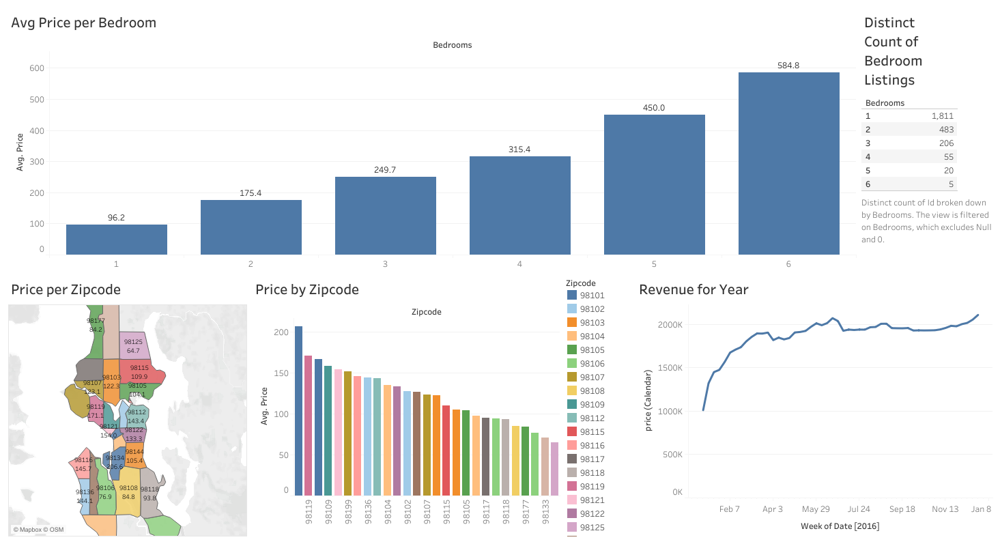

# AirBnB Tableau Dashboard Project


## Project Overview

This project is an interactive Tableau dashboard built from the Seattle Airbnb Open Data dataset. The dashboard was created as a guided portfolio project after completing Alex The Analyst's Tableau beginner project tutorial, then published to Tableau Public as a finished visualization.

The business scenario is simple: a potential Airbnb investor wants to understand where to buy, what property size may perform best, and when listings tend to generate more revenue. The dashboard answers those questions through location, pricing, bedroom count, and seasonal revenue views.

**Live Dashboard:** [View on Tableau Public](https://public.tableau.com/app/profile/nicanor.jr.peril/viz/AirBnBFullProject_17798355555580/Dashboard1?publish=yes)  
**Tutorial Reference:** [Full Beginner Project in Tableau | Alex The Analyst](https://www.youtube.com/watch?v=zOR0-nygfDE&list=PLUaB-1hjhk8GwbqoVmo_5zuhOa0Tcl3xC&index=5)



## Business Questions

- Which Seattle zip codes have the highest average Airbnb listing prices?
- Where are higher-priced listings located geographically?
- How does expected revenue change throughout the year?
- How does average price change by bedroom count?
- How much listing competition exists for each bedroom category?

## Dataset

The workbook contains three source tables:

| Sheet | Rows | Description |
| --- | ---: | --- |
| Listings | 3,818 | Listing-level details such as location, property attributes, bedrooms, and daily price |
| Calendar | 1,048,575 | Date-level listing availability and pricing records |
| Reviews | 84,850 | Review-level data connected to Airbnb listings |

Source file: [`data/Tableau Full Project.xlsx`](data/Tableau%20Full%20Project.xlsx)

Detailed workflow: [`step-by-step_guide.md`](step-by-step_guide.md)

## Tools Used

- Tableau Public
- Microsoft Excel
- Data modeling through joins and relationship checks
- Interactive dashboard design
- Geographic and time-series visualization

## Project Workflow

### 1. Connected the Data Source

The project started by connecting Tableau to the Excel workbook containing the `Listings`, `Calendar`, and `Reviews` sheets. The `Listings` table served as the main listing-level table because it contains the property, location, pricing, and bedroom fields used in the dashboard.

### 2. Reviewed the Data Structure

Before building visualizations, the dataset was reviewed to understand how the tables relate:

- `Listings.id` identifies each Airbnb property.
- `Calendar.listing_id` connects calendar pricing records back to each listing.
- `Reviews.listing_id` connects review records back to each listing.
- The `Reviews.id` field is a review identifier, not a listing identifier, so it should not be joined directly to `Listings.id`.

### 3. Built the Data Model

The main join used for the dashboard connected:

```text
Listings.id = Calendar.listing_id
```

The tutorial also demonstrates how the reviews table could be connected with:

```text
Listings.id = Reviews.listing_id
```

However, the final dashboard focuses on pricing, location, bedroom count, and yearly revenue, so the review data was not required for the final set of visuals.

### 4. Created Price by Zip Code

The first worksheet analyzes average listing price by zip code. Null zip codes were excluded, and price was aggregated as an average rather than a sum so each zip code could be compared fairly.

This view helps identify where Airbnb listings are generally priced higher.

### 5. Created Geographic Price Map

The second worksheet maps Seattle zip codes and labels them with average listing price. The map uses zip code geography to keep the location logic consistent with the zip code price chart.

This view adds geographic context to the pricing analysis and makes it easier to see where high-value areas are located.

### 6. Created Revenue by Year

The third worksheet uses `Calendar.date` and `Calendar.price` to build a time-series revenue view. Dates were shown at the weekly level within 2016, and incomplete 2017 data was filtered out to avoid a misleading year-end drop.

This view shows revenue patterns across the year and highlights stronger seasonal periods, especially summer and the holiday season.

### 7. Created Average Price by Bedrooms

The fourth worksheet analyzes how average daily listing price changes as the number of bedrooms increases. The `bedrooms` field was converted from a measure to a dimension, then null and zero-bedroom records were excluded.

This view helps compare potential earning power across property sizes.

### 8. Created Bedroom Listing Count

The fifth worksheet counts distinct listings by bedroom category. This provides a basic supply-side view of competition by property size.

This view shows that one-bedroom listings are the most common, while larger homes have fewer competing listings.

### 9. Designed the Final Dashboard

The final dashboard combines all five worksheets:

- Price by zip code
- Zip code map
- Revenue by year
- Average price by bedrooms
- Distinct count of bedroom listings

The layout was arranged so location and pricing insights are visible together, while bedroom and revenue trends support investment decision-making.

### 10. Published to Tableau Public

After completing the dashboard, the project was published to Tableau Public so it could be shared as part of a data analytics portfolio.

## Key Insights

- Zip code `98134` had the highest average listing price in the dataset at approximately `$206.60`.
- Average price generally increased as bedroom count increased.
- One-bedroom listings were the most common property type, creating more competition in that segment.
- Larger homes had fewer listings, suggesting lower supply, although demand would require further analysis.
- Revenue was stronger in summer and late-year holiday periods, making seasonality an important factor for Airbnb planning.

## Suggested Dashboard Captions

**Price by Zip Code:** Compares average Airbnb listing prices across Seattle zip codes to identify higher-value locations.

**Zip Code Map:** Adds geographic context to pricing trends by mapping average listing price across Seattle areas.

**Revenue by Year:** Shows weekly revenue patterns across 2016 to identify seasonal peaks and slower periods.

**Average Price by Bedrooms:** Shows how average daily price changes as bedroom count increases.

**Bedroom Listing Count:** Measures listing competition by counting distinct Airbnb properties in each bedroom category.

## What I Learned

Through this project, I practiced connecting Excel data to Tableau, validating join logic, selecting the correct aggregation for business questions, building multiple chart types, and combining them into a dashboard designed for decision-making.

I also learned the importance of checking field meaning before joining tables. Fields with similar names can represent different entities, and incorrect joins can produce misleading results.

## Future Improvements

- Add review score analysis to compare property size with guest satisfaction.
- Analyze occupancy or availability trends by month.
- Add filters for neighborhood, property type, or room type.
- Compare daily, weekly, and monthly pricing strategies.
- Rebuild the dashboard with the latest Airbnb data for a more current market view.

## Credit

This project was guided by Alex The Analyst's Tableau beginner project tutorial and recreated as a personal portfolio project using the Seattle Airbnb dataset.
